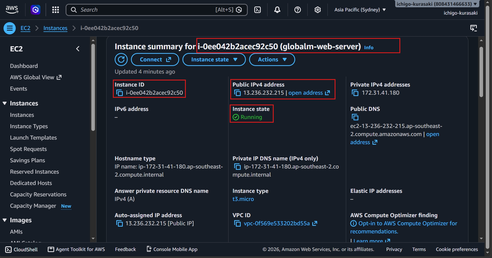
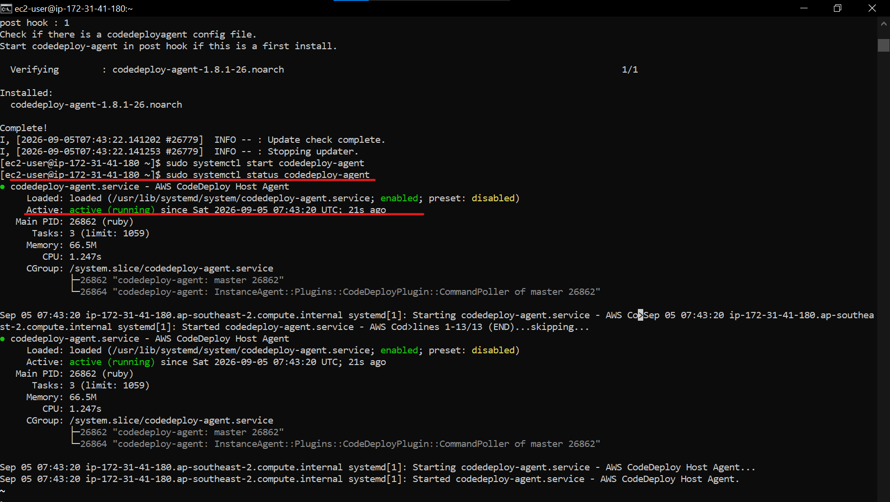
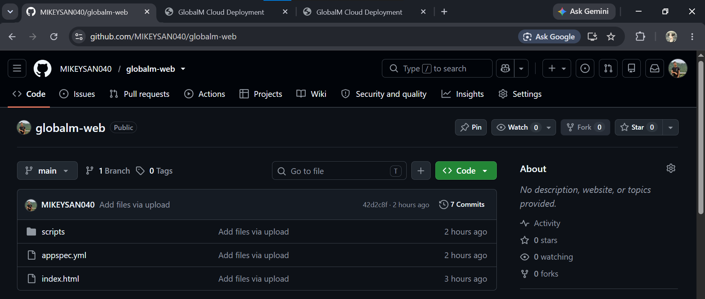
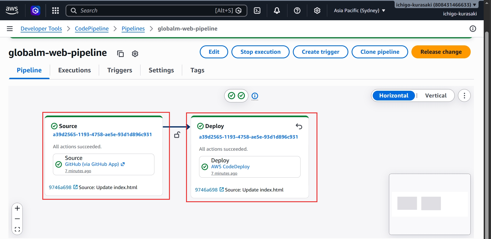
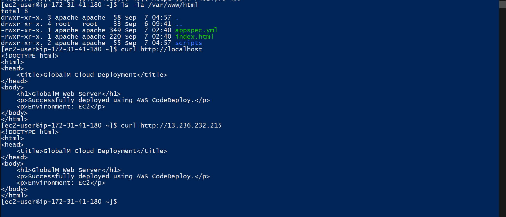
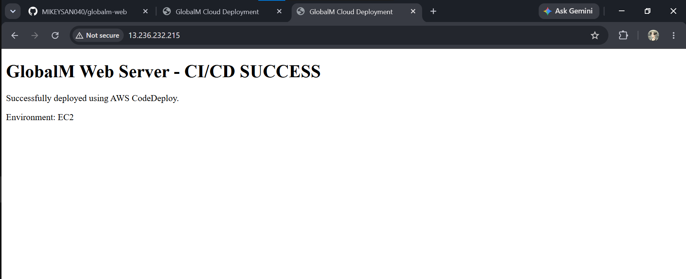

# GlobalM Web – AWS CI/CD Deployment

A hands-on AWS CI/CD project demonstrating how an application can be delivered from **GitHub to a live Amazon EC2 server using AWS CodePipeline and CodeDeploy**.

## Deployment Architecture

**GitHub -> CodePipeline -> S3 -> CodeDeploy -> EC2 -> Live Website**

---

## Deployment Flow

### 1. EC2 Environment Prepared

The EC2 server was prepared as the target environment for application deployment.

 Verified the target EC2 infrastructure was running and ready to receive the application.

---

### 2. CodeDeploy Agent Configured

The CodeDeploy Agent was installed and verified on the EC2 server.

 Confirmed the EC2 server was ready to receive automated deployments from AWS CodeDeploy.

---

### 3. GitHub Connected as Source

The application source code was maintained in GitHub and used as the starting point of the deployment pipeline.

 Established a version-controlled source repository for the automated delivery workflow.

---

### 4. CI/CD Pipeline Successfully Executed

AWS CodePipeline was configured to retrieve the application and trigger the deployment process.

 Validated the automated delivery pipeline from source code through the deployment workflow.

---

### 5. Application Deployed to EC2

CodeDeploy successfully delivered the application to the EC2 target server.

 Confirmed that the automated deployment successfully updated the target EC2 environment.

---

### 6. Live Application Validated

The deployed application was accessed successfully after the pipeline completed.

 Completed end-to-end validation by confirming the application was available to users.

---

## Key Skills Demonstrated

**AWS, CI/CD, CodePipeline, CodeDeploy, EC2, S3, IAM, GitHub, Linux, Deployment Validation**

## Deployment Outcome

Successfully implemented and validated an automated deployment workflow:

**Developer Commit -> GitHub -> CodePipeline -> CodeDeploy -> EC2 -> Live Application**

This project demonstrates practical experience with **cloud deployment automation, infrastructure preparation, CI/CD workflows, and post-deployment validation**.
