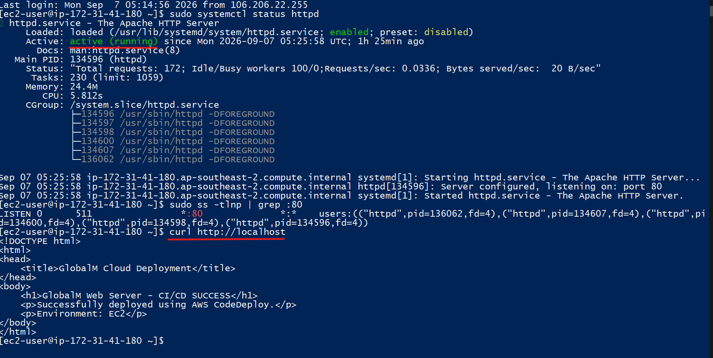
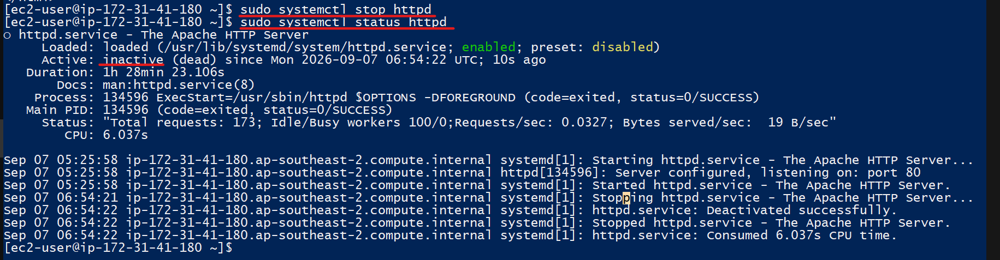
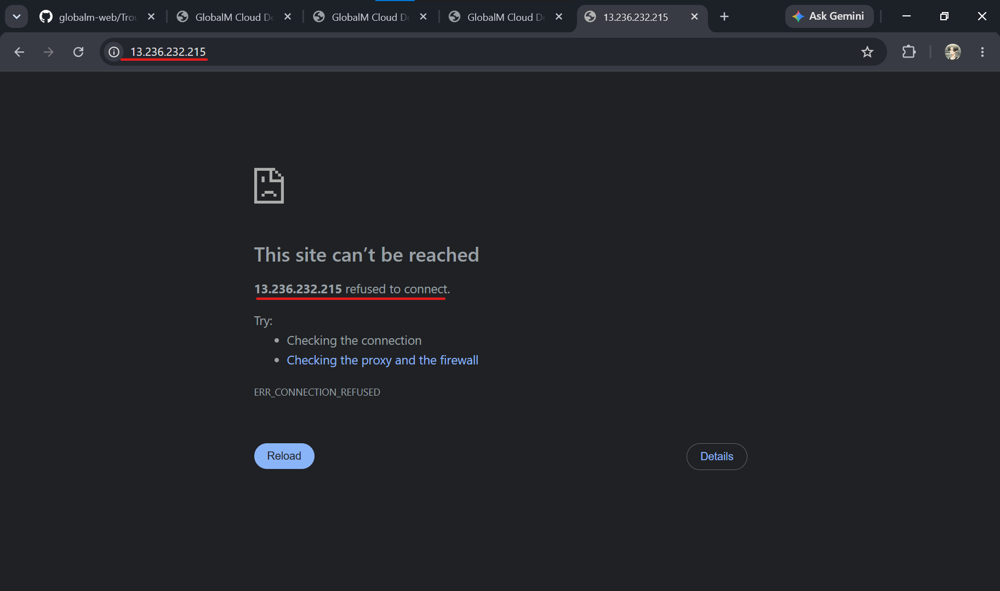
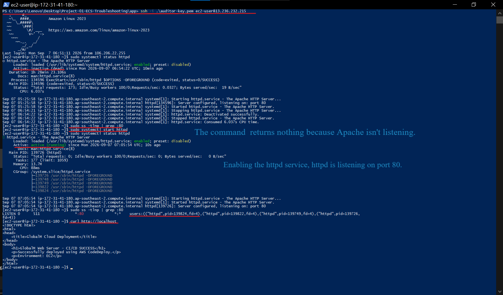
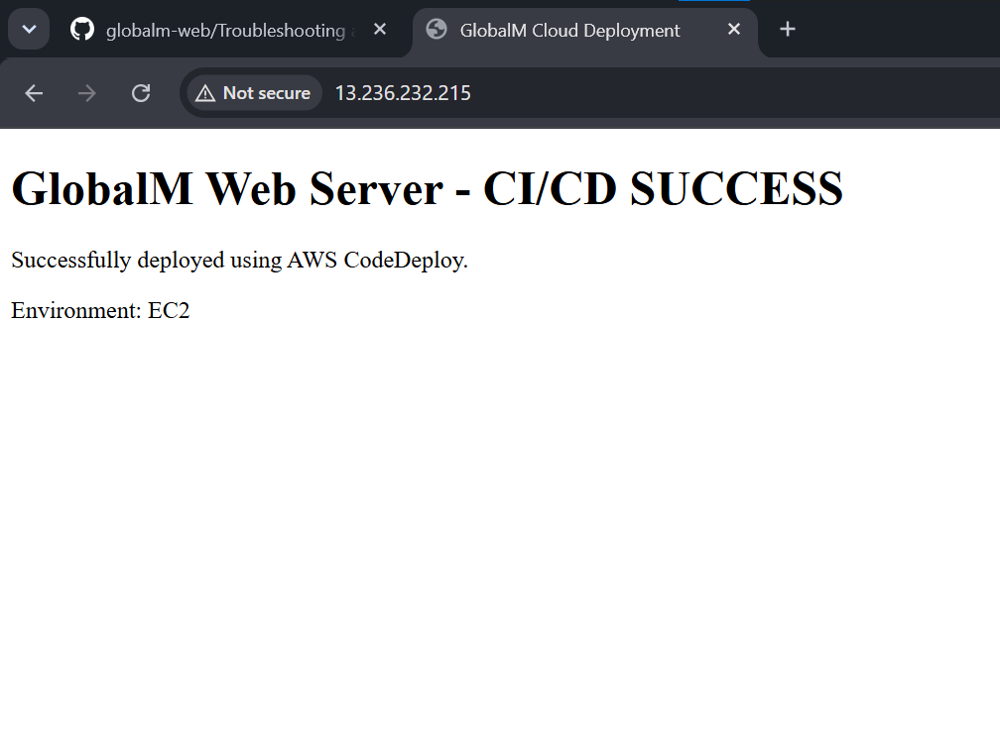

# Incident 01 — Apache Service Failure

## Incident Overview

The GlobalM website was initially verified as working correctly. During a controlled troubleshooting exercise, the Apache web server on the EC2 instance was intentionally stopped to simulate a real-world website outage.

The objective was to identify the cause of the outage using a structured Cloud Support troubleshooting approach and restore the service with minimal intervention.

## 1. Baseline — Application Working

Before introducing the failure, the public website was verified to be accessible through the EC2 public IP address.

This established a known-good baseline before troubleshooting began.

## 2. Incident Introduced — Apache Service Stopped

The Apache (`httpd`) service was intentionally stopped on the EC2 instance to simulate a web-server failure.

The EC2 instance itself remained operational, but the web service was no longer running.

## 3. User Impact — Website Unavailable

After the service was stopped, the website was accessed again from the browser.

The application was no longer reachable, confirming the user-facing impact of the incident.

### Observed Symptom

> Website unavailable even though the EC2 instance was running.

## 4. Investigation, Root Cause & Recovery

The Apache service status and HTTP port 80 were checked to determine why the website was unavailable.

The investigation confirmed that Apache was inactive and was therefore not listening for HTTP requests on port 80.

The Apache service was then restarted and the service and port availability were verified.

### Root Cause

The Apache (`httpd`) web server service was stopped, preventing the EC2 instance from serving HTTP traffic.

### Resolution

The Apache service was restarted and HTTP port 80 was verified to be available.

## 5. Final Validation — Application Restored

After the technical recovery, the public website was accessed again to confirm that the service had been successfully restored.

**Evidence:** `06-website-recovered.png`

The website was accessible again, confirming successful incident resolution.

## Troubleshooting Method

**Baseline -> Identify Symptom -> Investigate -> Find Root Cause -> Resolve -> Validate**

## Cloud Support Skills Demonstrated

* Amazon EC2 troubleshooting
* Linux service management
* Apache/httpd troubleshooting
* HTTP port verification
* Root-cause analysis
* Incident resolution
* Service validation
* Evidence-based troubleshooting

## Key Takeaway

This incident demonstrates the ability to troubleshoot a cloud-hosted application systematically rather than immediately restarting or redeploying the environment.

The issue was isolated to the web-server service, resolved with a targeted fix, and validated from both the server and user perspectives.
