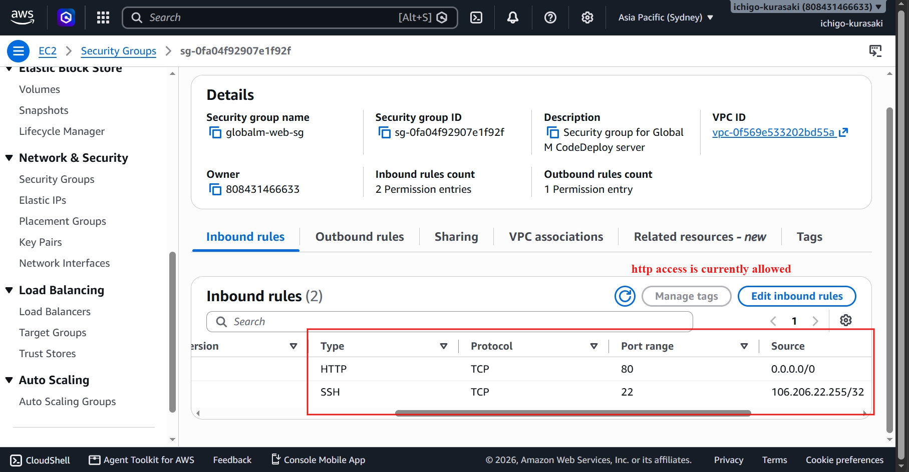
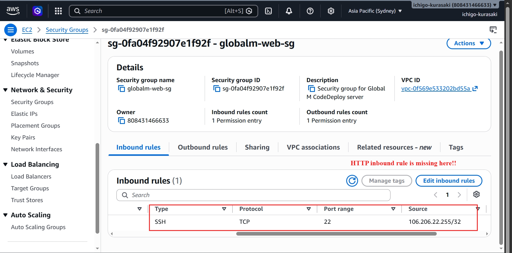
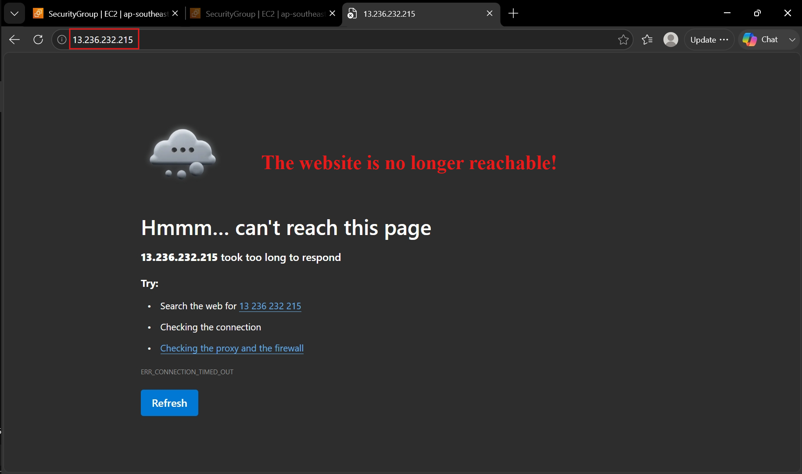
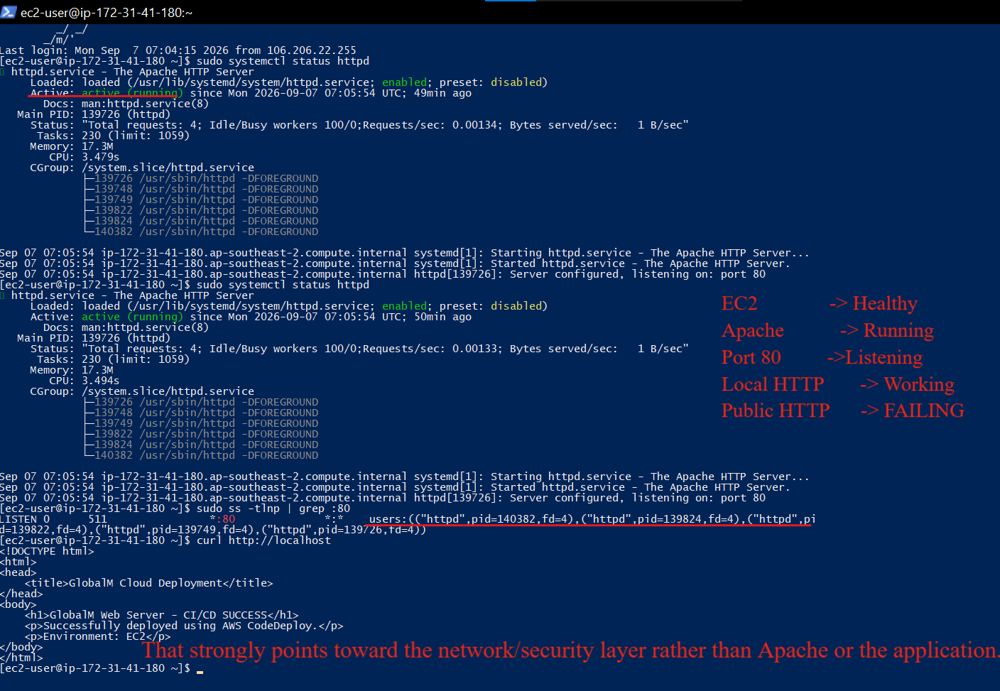
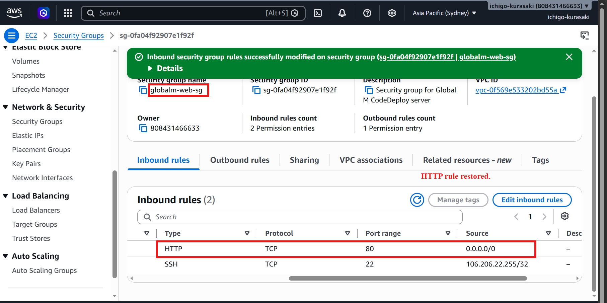
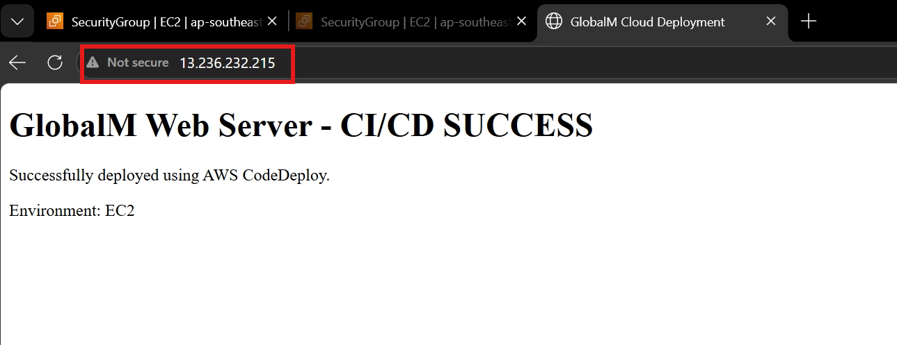

# Incident 02 — Security Group Misconfiguration (HTTP Blocked)

## Incident

A controlled network failure was introduced by removing the HTTP (TCP 80) inbound rule from the EC2 Security Group. This simulated a common cloud support issue where the application is healthy but inaccessible from the internet.

## 1. Baseline

The Security Group was initially configured to allow HTTP traffic, and the website was accessible through the EC2 public IP.

## 2. Failure Introduced

The inbound HTTP (TCP 80) rule was removed from the Security Group while leaving the EC2 instance and Apache service unchanged.

## 3. User Impact

The website became unreachable from the browser, despite the EC2 instance continuing to run.

## 4. Investigation

The EC2 instance, Apache service, and HTTP listener were verified. Local requests succeeded, confirming that the application was healthy and isolating the issue to the network layer.

### Root Cause

The Security Group no longer allowed inbound HTTP (TCP 80) traffic, preventing external users from accessing the application.

## 5. Resolution

The HTTP inbound rule was restored to the Security Group.

## 6. Validation

The website was successfully accessed again through the public IP, confirming that network connectivity had been restored.

## Skills Demonstrated

* AWS EC2
* Security Group management
* HTTP/Port 80 troubleshooting
* Network connectivity analysis
* Root-cause isolation
* Incident resolution
* Service validation

## Troubleshooting Approach

**Identify -> Investigate -> Isolate -> Resolve -> Validate**
