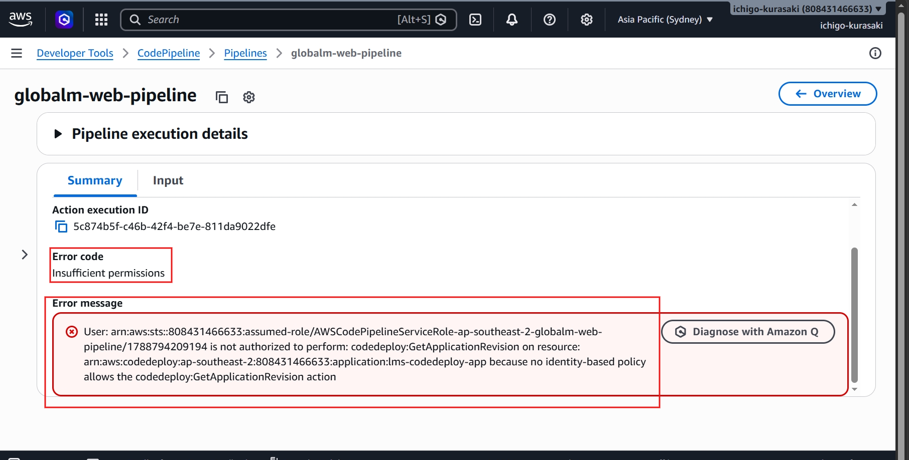
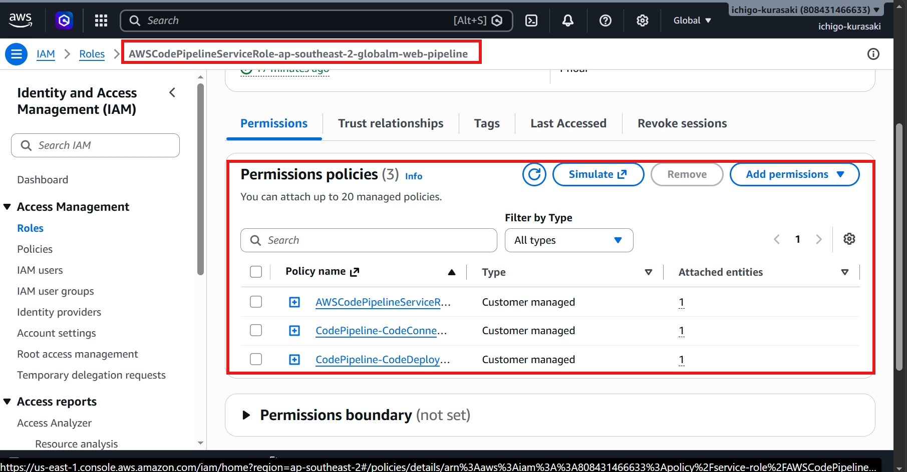
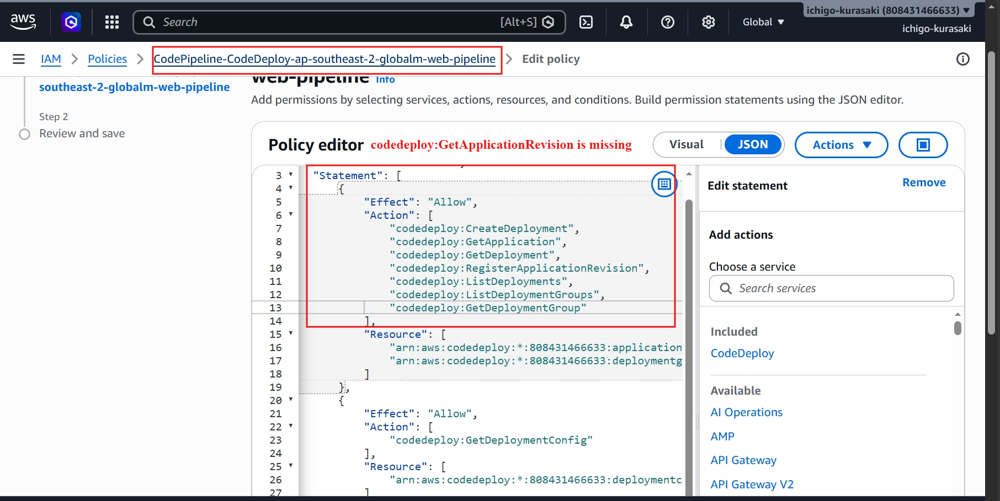
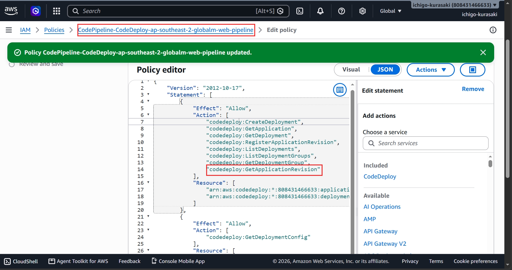
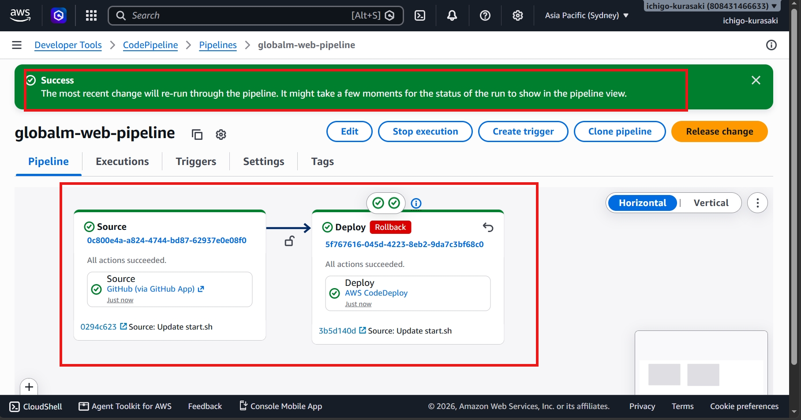

# Incident 03 – CodePipeline IAM Permission Failure

## Overview

A CodePipeline deployment failed due to insufficient IAM permissions, preventing CodePipeline from accessing the CodeDeploy application revision.

---

## 1. Deployment Failure

The pipeline failed during the Deploy stage with an **Insufficient permissions** error.

**Observation:** The error indicated that the CodePipeline service role was not authorized to perform `codedeploy:GetApplicationRevision`.

---

## 2. Investigation

The CodePipeline service role and its attached IAM policies were reviewed.

The IAM policy was inspected to identify the missing permission.

**Root Cause:** The `codedeploy:GetApplicationRevision` permission was not included in the service role policy.

---

## 3. Resolution

The missing IAM permission was added to the policy and the pipeline was executed again.

---

## 4. Validation

The deployment completed successfully and the application was verified.

---

## Skills Demonstrated

* AWS IAM
* AWS CodePipeline
* AWS CodeDeploy
* CI/CD Troubleshooting
* Root Cause Analysis
