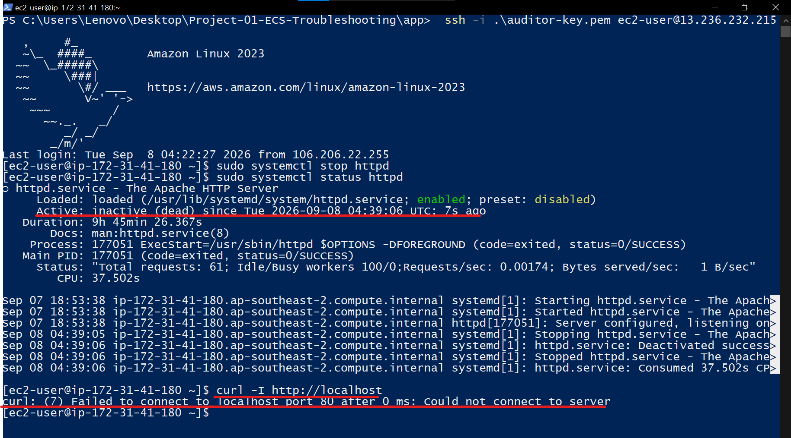
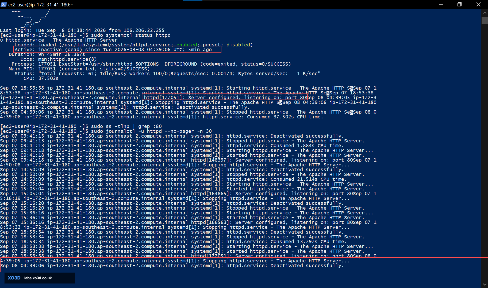
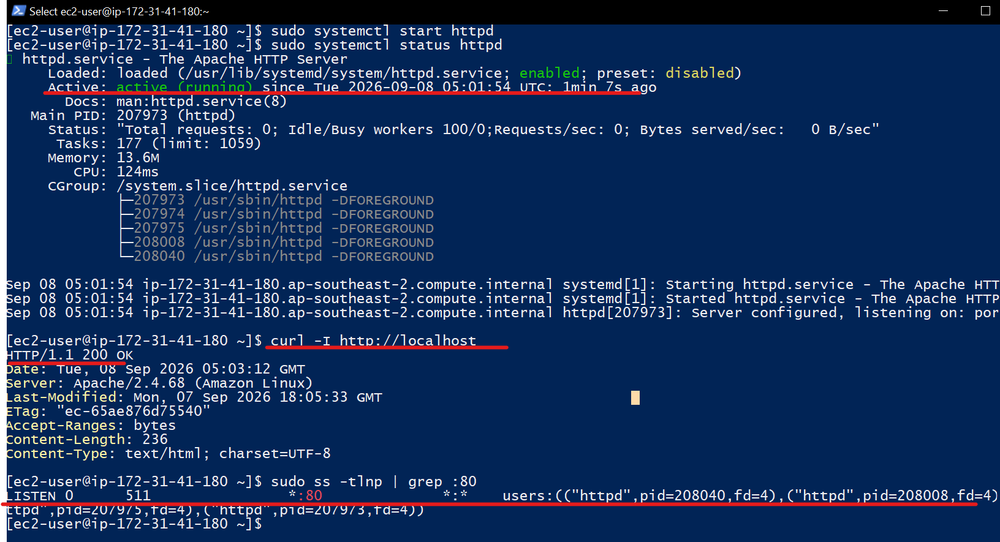
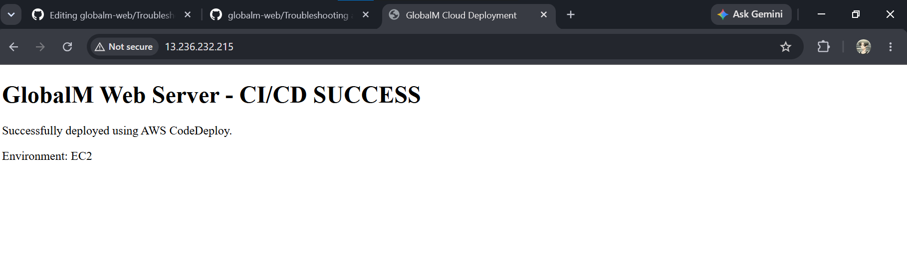

# Incident 05 — EC2 Application Unreachable

## Overview

**Issue:** Web application hosted on an EC2 instance became unreachable.

**Support Ticket:**

> “The web application is not accessible. Please investigate and restore service.”

**Impact:** Users could not access the application.


---

## Troubleshooting Flow

**User Report -> Investigate -> Identify Root Cause -> Remediate -> Validate**

---

## Investigation

### 1. Application Unreachable

The application was tested and found to be unavailable.



### 2. Service & Port Investigation

Apache service status showed:

* `httpd` was **inactive (dead)**
* Port **80 had no active listener**
* System logs confirmed Apache had been stopped



### 3. Root Cause

**Root Cause:** Apache HTTP Server was stopped on the EC2 instance.

Because Apache was not running, the server was not listening on port 80, making the web application unreachable.

---

##  Remediation

Apache was restarted:

```bash
sudo systemctl start httpd
```

The service was then verified as **active (running)**.

Local application and port 80 connectivity were also validated.



---

## Final Validation

The application was accessed externally through the EC2 public IP and successfully loaded.



**Result:** Application service restored and user access confirmed.


---

## Skills Demonstrated

* EC2 troubleshooting
* Linux service management
* Apache troubleshooting
* Port/listener verification
* Application availability troubleshooting
* Log analysis
* Root-cause identification
* Service restoration
* End-to-end validation
* Incident documentation

### Support Workflow

**Detect -> Investigate -> Identify Root Cause -> Remediate -> Validate -> Document**
